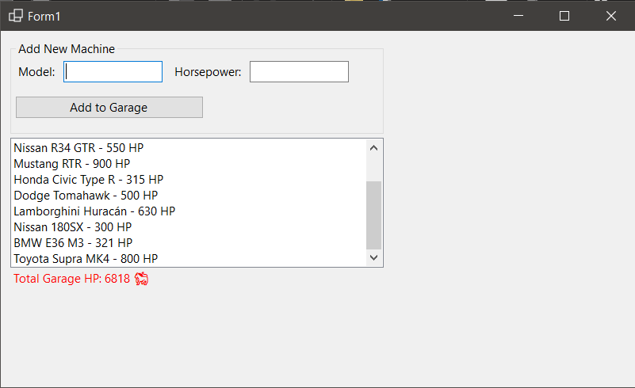

# 🏎️ Dream Garage Manager (C# WinForms)

A dynamic inventory management system built to demonstrate Object-Oriented Programming (OOP) principles in .NET 8.0.

### 🛠️ Key Features
* **Object-Oriented Design:** Uses a custom `Car` class to model data.
* **Dynamic Collections:** Utilizes `List<T>` for scalable memory management.
* **Real-Time Analytics:** Algorithmic calculation of total fleet statistics (Total HP) upon every entry.
* **Input Validation:** `TryParse` logic ensures data integrity and prevents crashes.
* **Responsive UI:** Auto-scrolling list view capable of handling large datasets.

### 📸 Screenshot

### 💻 Tech Stack
* C#
* Windows Forms (.NET 8.0)
* Visual Studio 2022
